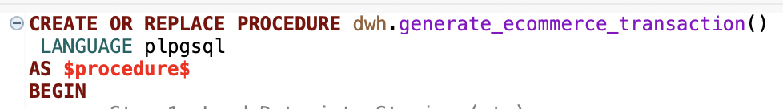
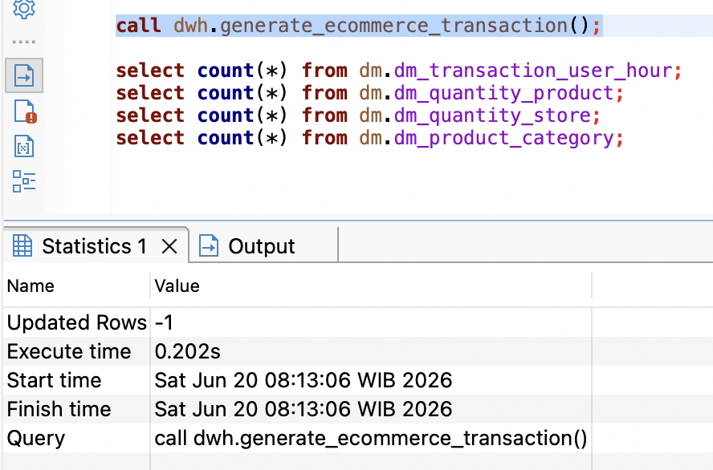
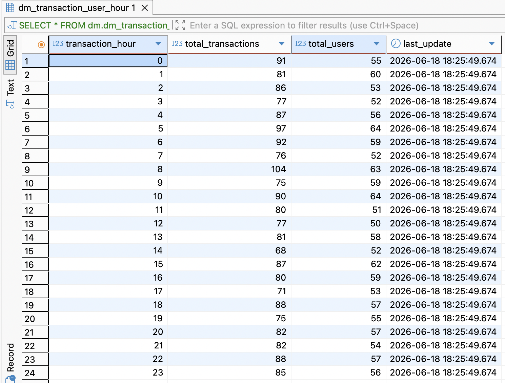
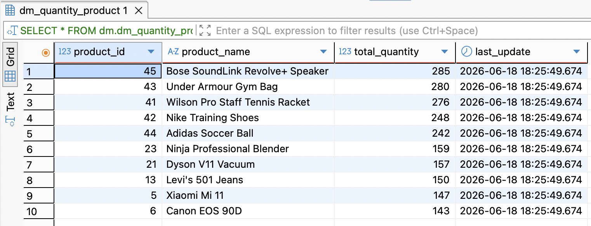
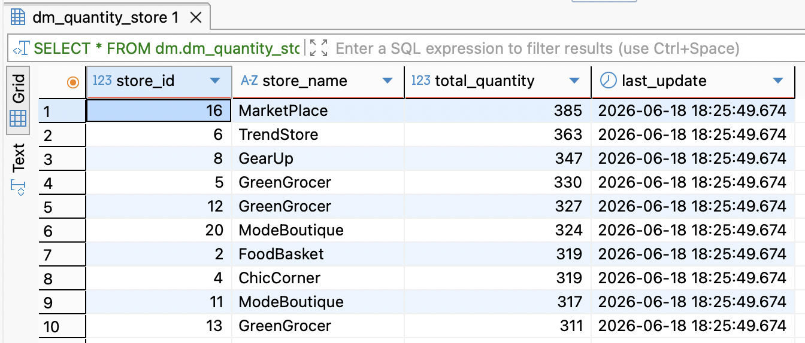
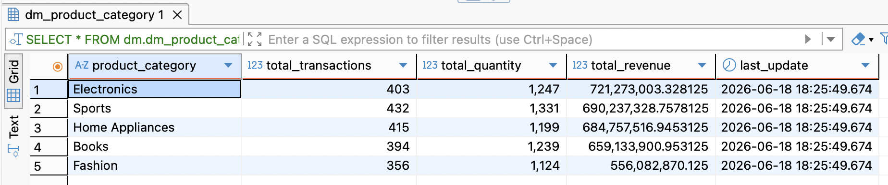

# E-Commerce ETL Data Warehouse Project

## Overview

This project demonstrates the implementation of an end-to-end ETL (Extract, Transform, Load) process using PostgreSQL for an e-commerce transaction dataset.

The project covers:

- Staging Layer
- Dimension Tables
- Fact Table
- Data Mart
- Stored Procedure Automation
- Table Partitioning

---

## Data Warehouse Architecture

```text
Source Data
    ↓
Staging
    ↓
Dimension Tables
    ↓
Fact Table
    ↓
View
    ↓
Cube
    ↓
Data Mart
```

---

## ETL Process

### Extract

Data is extracted from the source table:

```sql
public.ecommerce_transaction
```

and loaded into:

```sql
stg.stg_ecommerce_transaction
```

### Transform

Data is transformed into:

- dim_ecommerce_product
- dim_ecommerce_store
- dim_ecommerce_user
- fact_ecommerce_transaction

### Load

The transformed data is loaded into analytical Data Marts.

---

## Stored Procedure Automation

The entire ETL process is automated using:

```sql
CALL dwh.generate_ecommerce_transaction();
```

### Stored Procedure



### Run Stored Procedure



---

## Partitioning

Range Partitioning is implemented on:

```sql
dm.dm_cube_ecommerce_transaction
```

using:

```sql
PARTITION BY RANGE(transaction_date)
```

This improves query performance and data management for large datasets.

---

## Data Mart Results

### 1. Transaction per Hour

Monitor total transactions and total users per hour.



---

### 2. Product Quantity

Monitor best-selling products.



---

### 3. Store Quantity

Monitor top-performing stores.



---

### 4. Revenue by Product Category

Monitor revenue contribution by product category.



---

## Technologies Used

- PostgreSQL
- SQL
- ETL
- Data Warehouse
- Data Mart
- Stored Procedure
- Partitioning

---

## Project Outcome

The ETL process successfully transformed raw transaction data into a structured Data Warehouse and Data Mart environment. The implementation of Stored Procedures automated the refresh process, while Partitioning improved scalability and query efficiency.
